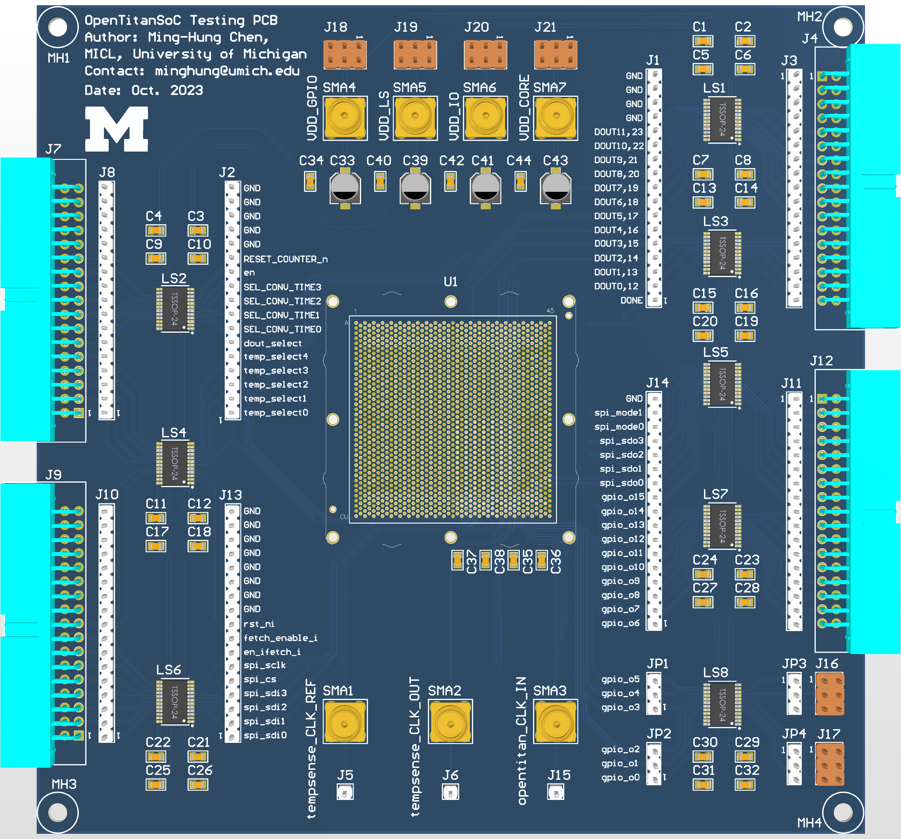
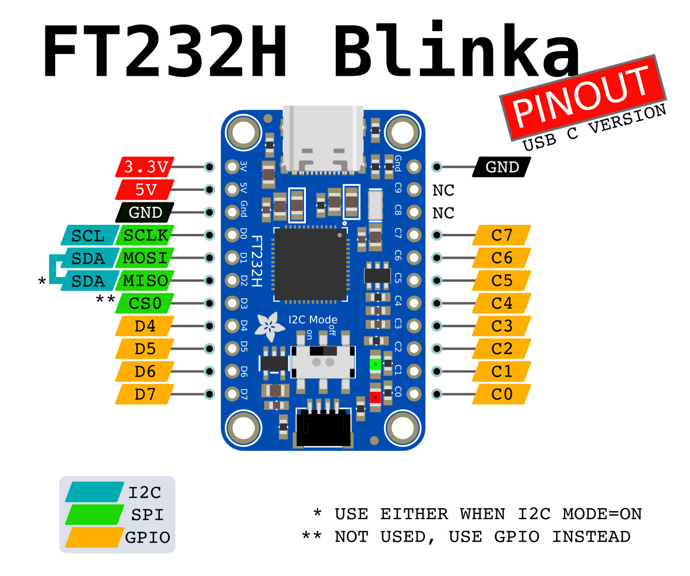
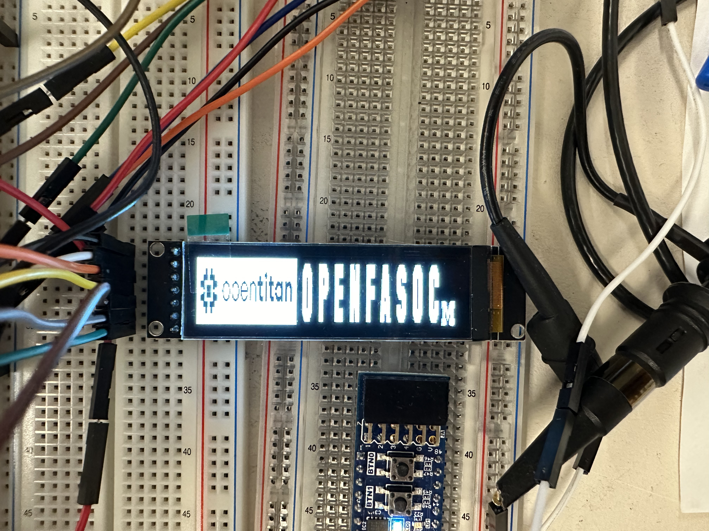

# TestSetup-Intel16OpenTitanSoC

This repository provides a fully open-source test setup solution for an OpenTitan chip tapd-out in Intel 16nm with OpenROAD-generated OpenTitan subset instances and 24 OpenFASOC-generated temperature sensor instances. The setup is highly automated with Python and open-source libraries, where the chip is controlled through low-cost commercially-available microcontroller.

**Author:** [Ming-Hung Chen](https://www.linkedin.com/in/ming-hung-chen-85ab311b6/) from the [University of Michigan, Ann Arbor](https://micl.engin.umich.edu)
\
**Advisor:** [Mehdi Saligane](https://www.linkedin.com/in/mehdi-saligane/) from the [University of Michigan, Ann Arbor](https://micl.engin.umich.edu)

## 1. Prerequisites
### 1.1 **Host Computer**
A host computer with Windows 10 operating system is required. Either a desktop or a laptop works.

### 1.2 **Python**
Please install the latest version of [Anaconda](https://www.anaconda.com/products/individual) on the host computer and use Spyder for running the test scripts.

## 2. Test Setup
### 2.1 **PCB for the Chip**
The printed circuit board (PCB) could be as simple as one that directly connects all the chip I/Os to headers and power supplies to SMA or banana connectors. Level conversion from 3.0V to 1.2V is required as the chip uses 1.2V I/O voltage. Intel provides BGA packages, including fabricated  chip and solderless socket. The PCB designed for validating this setup is shown below as a reference:


Fig. 1. Top view of the PCB

### 2.2 **FT232H USB-to-GPIO/SPI Microcontroller**
One [FT232H](https://www.adafruit.com/product/2264#description) USB to GPIO, SPI microcontroller from AdaFruit are needed in this setup for controlling the chip. Please purchase it online from Adafruit. After getting the board, follow this [page](https://learn.adafruit.com/circuitpython-on-any-computer-with-ft232h/windows) `Plug in FT232H & Fix Driver with Zadig` part to install driver for the microcontroller using [Zadig](https://zadig.akeo.ie) on the host computer.

After the driver is installed, open an Anaconda prompt on the host computer, install [pyftdi](https://eblot.github.io/pyftdi/api/spi.html) libraries:

```  
pip install pyftdi 
```

After the installations, connect the microcontroller to the PCB via jumper wires according to `PinMap.md` in this repository. The pin numbers of bridge boards are already printed on-board, like what is shown in Fig. 2, while the chip I/O names are printed on the top of the PCB shown in Fig. 1. After connecting the chip I/Os, also remember to connect the ground pins to the PCB ground for a common ground.


Fig. 2. FT232H USB-to-GPIO/SPI Microcontroller
<br /><br />

The last step for setting-up the microcontroller is to connect them to the host computer via USB cables and figure out what their USB addresses are. Use `find_usb_addr()` function in `tools.py` in this repository to achieve that. After that, replace line `7` in `opentitan_ctrl.py` and `sh1122_ctrl.py` with the correct USB addresses you get.

## 3. Running the Scripts for Automated Testing

### 3.1 **opentitan_demo.py**
This script provides a sanity check for testing the chip. The script will ask the user to turn on the clock source and power supplies to the chip. Then the script will make the chip program SH1122 LCD display with SPI protocol. The cool logo should be shown like Fig. 3.


Fig. 3. Demo logo with SH1122 LCD display
<br /><br />

## 4. Acknowledgements
The author would like to thank Intel for fabrication of the test chip.

## 5. License
The source code is released under [Apache License 2.0](https://www.apache.org/licenses/LICENSE-2.0).

For any technical issues, please contact Ming-Hung Chen (minghung@umich.edu) and Mehdi Saligane (mehdi@umich.edu).