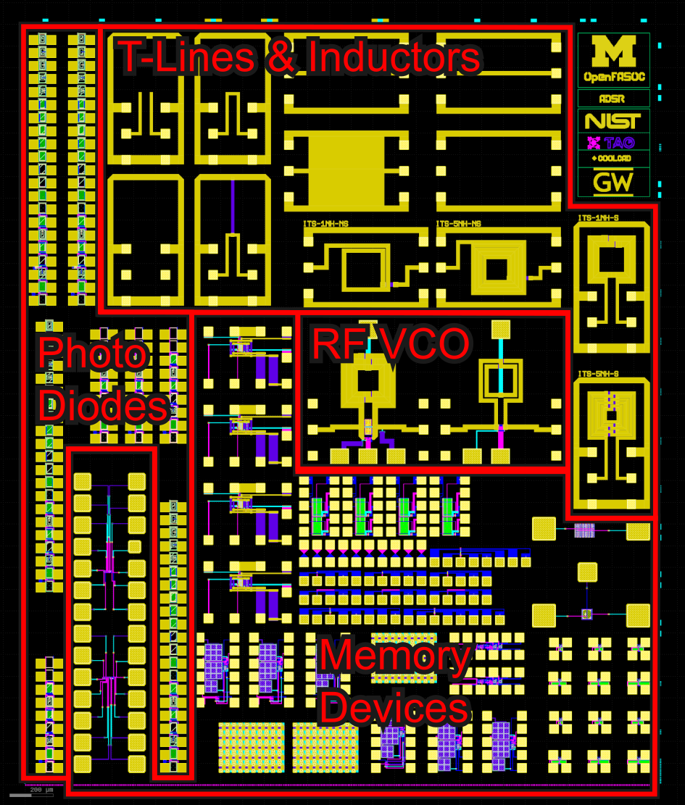

# MPW-7: SkyWater 130nm Cryogenic Test Structure

This directory contains the Multi-Project Wafer 7 (MPW-7) tapeout featuring test structures designed for cryogenic temperature characterization in SkyWater 130nm technology.

## Tapeout Information

- **Shuttle**: Google Open MPW-7
- **Process**: SkyWater 130nm (SKY130)
- **Submission**: 2022
- **Fabrication**: 2022
- **Status**: Manufactured

## Overview

This tapeout contains additional test structures for characterizing circuit behavior at cryogenic temperatures (down to 4 Kelvin), building on the MPW-6 cryogenic characterization efforts. The structures enable comprehensive measurements of device performance in extreme low-temperature conditions, which is critical for applications in quantum computing, space electronics, and superconducting circuits.

## Contents

- **gds/**: Final GDSII layout files
- **fig1c.png**: Annotated die shot showing test structure layout

## Key Features

- **Temperature Range**: Designed for testing from room temperature down to 4K
- **Test Structures**: Includes various device primitives and circuits for cryogenic characterization
- **Open PDK**: Expanding cryogenic characterization database for open-source SKY130 PDK
- **Applications**: Enables quantum computing circuits, cryogenic CMOS, and ultra-low temperature electronics

## Authors

- **Anhang Li** - Brown University (Lead, formerly University of Michigan)
- **Mehdi Saligane** - Brown University (PI, formerly University of Michigan)

## Related Publications

**A. Li et al.**, "Unlocking Circuits for Quantum With Open Source Silicon: A first look at measured open source silicon results at 4 K," *IEEE Solid-State Circuits Magazine*, vol. 16, no. 2, pp. 39-48, 2024.
- DOI: [10.1109/MSSC.2024.3390872](https://doi.org/10.1109/MSSC.2024.3390872)
- [IEEE Xplore](https://ieeexplore.ieee.org/document/10530621)

This paper presents the first measured results from open-source silicon test structures at cryogenic temperatures, demonstrating the viability of open PDKs for quantum and cryogenic applications.

**A. Akturk, A. Li, M. Saligane, et al.**, "CMOS Sky130 Primitives measured at cryogenic temperatures," National Institute of Standards and Technology, 2024.
- DOI: [10.18434/mdc2-d5k4](https://doi.org/10.18434/mdc2-d5k4)
- [NIST Data Repository](https://data.nist.gov/od/id/mdc2-d5k4)

Comprehensive measurement database of SKY130 device primitives at cryogenic temperatures.

**A. Akturk, A. Tripathi, and M. Saligane**, "Cryogenic modeling for open-source process design kit technology," in *2023 IEEE BiCMOS and Compound Semiconductor Integrated Circuits and Technology Symposium (BCICTS)*, 2023.
- DOI: [10.1109/BCICTS58340.2023.10352971](https://doi.org/10.1109/BCICTS58340.2023.10352971)
- [IEEE Xplore](https://ieeexplore.ieee.org/document/10352971)

Device modeling framework for cryogenic operation in open-source PDKs.

## Acknowledgements

The authors would like to thank Google and SkyWater Technology Foundry for fabrication through the Open MPW Shuttle program, and NIST for supporting cryogenic characterization efforts.

## License

The source code is released under [Apache License 2.0](https://www.apache.org/licenses/LICENSE-2.0).

For any technical issues, please contact Mehdi Saligane (mehdi@brown.edu).
